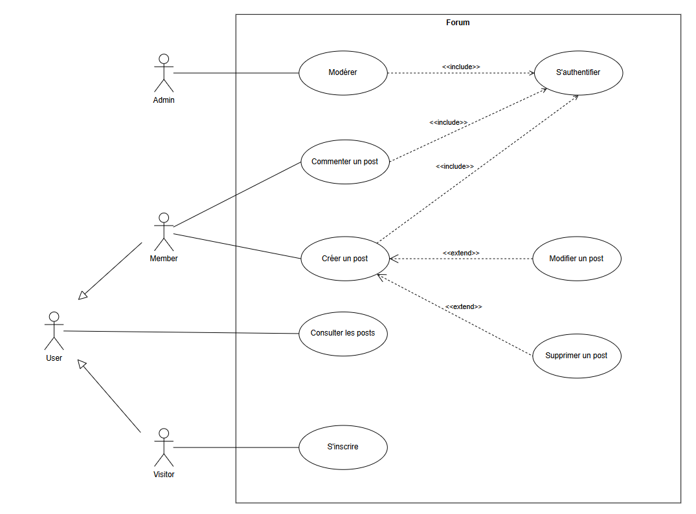

# DOCUMENT DE SPÉCIFICATIONS FONCTIONNELLES

Nom du projet : mon-api-nodejs

Client / Organisation : M2I Formation

Auteur(s) : Rania Badis - Elève

Version : v1.0.0

Date : 11/03/2026

Statut :

- [x] Brouillon
- [ ] En validation
- [ ] Validé

## HISTORIQUE DES VERSIONS

| Version | Date       | Auteur      | Description              |
|--------:|------------|-------------|--------------------------|
|  v1.0.0 | 11/03/2026 | Rania Badis | Initialisation du projet |

## 1. CONTEXT DU PROJET

### 1.1 Présentation générale

> Ce document décrit les spécifications fonctionnelles d'une API REST Stateless destinée à une gestion centralisée d'un
> forum.

Dans un contexte de croissance et de diversification des canaux (application mobile, application web, interface
client dédiée, etc.), l'api vous permettra de centraliser vos données.

### 1.2 Objectifs du projet

#### Objectifs spécifiques du projet :

- Centraliser, faciliter l'acces et manipuler de l'information dans un endroit unique.

## 2. PÉRIMÈTRE

### 2.1 Inclus dans le projet

#### Fonctionnalités incluses :

- Authentification utilisateurs
- Gestion de posts
- Ajouter des commentaires aux posts

### 2.2 Exclus du projet

#### Non inclus :

- Repondre à des commentaires.
- Modération (administration)

#### Évolution future :

- Développement d’une application web (React).
- Développement d’une application mobile native (React Native).

## 3. ACTEUR

| Acteur         | Description                     | Droits        |
|----------------|---------------------------------|---------------|
| Visiteur       | Visiteur du système             | Accès limité  |
| Utilisateur    | Utilisateur standard du système | Accès basique |
| Administrateur | Modérateur du système           | Accès complèt |


## 4. DESCRIPTION FONCTIONNELLE DÉTAILLÉE

### 4.1 Cas d'utilisation



#### UC-01 - Inscription utilisateur

```
Acteur : Visiteur

Donnée d'entrée :
Le cas commence lorsqu'il clique sur le bouton s'inscrire

Scénario principal :
    1. Le système demande à l'utilisateur de saisir username, email et mot de passe.
    2. L'utilisateur saisit ses informations puis valide.
    3. Le système informe que le compte est crée.

Scénario d'erreur : Client déjà existant
    3a. Le système informe le client qu'il est déjà existant.
    Retour à l'étape 1.

Scénario d'erreur : Champs requis
    3a. Le système informe que certains champs sont requis.
    Retour à l'étape 1.
```

#### UC-02 - Authentification utilisateur

```
Acteur : Utilisateur

Donnée d'entrée :
Le cas commence lorsqu'il clique sur le bouton se connecter

Scénario principal :
    1. Le système demande à l'utilisateur de saisir email et mot de passe.
    2. L'utilisateur saisit un email et mot de passe puis valide.
    3. Le système informe qu'il est connecter.
    4. L'utilisateur est connecté.

Scénario d'erreur : Identifiant invalide
    3a. Le système informe les identifiants sont invalides.
    Retour à l'étape 1.
```

#### UC-03 - Création d'un post

```
Acteur : Utilisateur

Donnée d'entrée :
Le cas commence lorsque l'utilisateur est authentifié clique sur le bouton créer un post.

Scénario principal :
    1. Le système demande à l'utilisateur de saisir titre, contenu et statut.
    2. L'utilisateur saisit les informations puis valide.
    3. Le système informe que le post à bien été crée.

Scénario d'erreur : Champs requis
    3a. Le système informe que certains champs sont requis.
    Retour à l'étape 1.
```

## 5. RÈGLES DE GESTION

- **RG-001** : Une adresse email ne peut être utilisée qu’une seule fois.
- **RG-002** : Le statut choisit fait partie d'une liste d'énumeration.

## 6. EXIGENCES NON FONCTIONNELLES

#### Exigences spécifiques :

- Le temps de chargement d’une réponse ne doit pas dépasser 50ms.
- Authentification via access token (JSON Web Token - JWT).
- Conformité RGPD.

### 7.1 Performance

- Mise en cache des requêtes retournant des données avec pagination.

### 7.2 Sécurité

- Authentification access token (**JSON Web Token**) des requêtes nécessitant une authentification.

#### Exigences à respecter

- API Design **REST**
- API **Stateless**

### 7.3 Compatibilité

#### Environnement

- Développement
- Production

### 8. CONTRAINTES

#### Contraintes spécifiques :

- Hébergement sur Amazon Web Services (AWS).

#### Contraintes réglementaires :

- Respect du RGPD.

#### Contraintes deadline :

- Mise en production avant le 30 mai 2026.

### 9. LEXIQUE

- **API** : Application Programming Interface.

- **API REST** : Respecte les principes de conception du style architectural REST.
  Le principe de base de REST repose sur le protocole de communication HTTP et la notion de ressources, qui peuvent correspondre à n'importe quel élément d'information, comme un utilisateur, un produit, un document ou une collection d'éléments.

- **API Stateless** : Ne stocke aucun état ou donnée entre les requêtes.

- **JSON Web Token (JWT)** : Protocole permettant la transmission de données de manière sécurisée sous la forme d'un objet JSON, lui-même vérifié par une signature numérique.
 