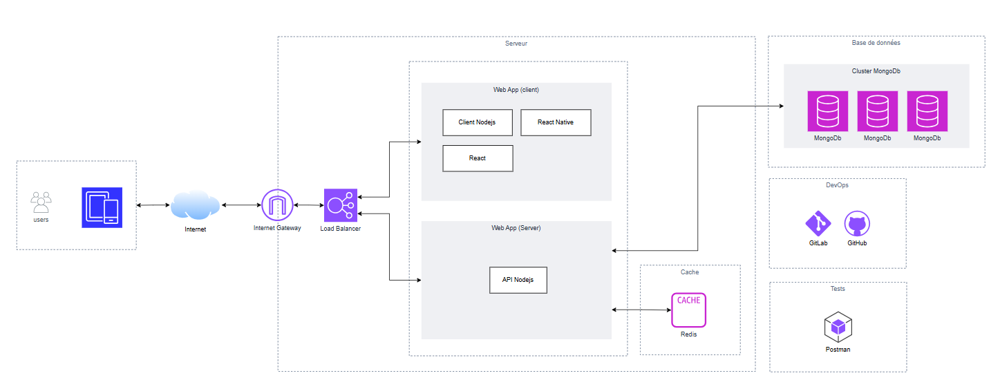
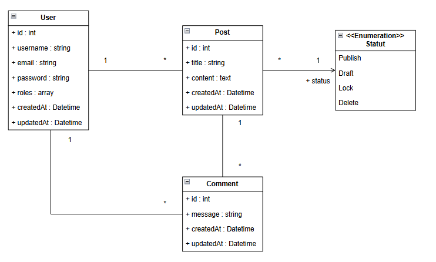

# DOCUMENTATION TECHNIQUE

Nom du projet : mon-api-nodejs

Client / Organisation : M2I Formation

Auteur(s) : Badis Rania - Elève

Version : v1.0.0

Date : 11/03/2026

Statut :

- [x] Brouillon
- [ ] En validation
- [ ] Validé

## HISTORIQUE DES VERSIONS

| Version | Date       | Auteur      | Description              |
|--------:|------------|-------------|--------------------------|
|  v1.0.0 | 11/03/2026 | Badis Rania | Initialisation du projet |

## 1. INTRODUCTION

### 1.1 Objectif du document

> Ce document décrit l'architecture technique, les composants metiers, les technologies utilisées et les choix
> d'implémentation de l'application

L'objectif spécifique du document est de permettre à une nouvelle équipe technique de maintenir et faire évoluer l'application.

### 1.2 Références
- [Spécification fonctionnelles v1.0.0][1]
- [Documentation API v1.0.0][2]

[1]: ./functional_documentation.md
[2]: https://postman.com

## 2. ARCHITECTURE GENERALE

### 2.1 Vue d'ensemble
l'application repose sur une architecture N-tiers :
- Backend (API)
- Base de données

### 2.2 Diagramme  d'architecture


## 3. ENVIRONNEMENT TECHNIQUE
### 3.1 Stack technologique
- Langage
    - `javascript`

- Backend
    - `Node|v25.6.1`
    - `Express|v5.2.1`

- Base de données
    - `MongoDB|v7.1.0`
    - `Redis|v5.11.0`

### 3.2 Environnements
Environnements disponibles :
- Dévelopment
- Production

## 4. ARCHITECTURE APPLICATIVE
### 4.1 Structure du projet
```
mon-api-nodejs
  |__ configs/
  |__ fixtures/
  |__ middlewares/
  |__ models/
  |__ routes/
```

## 5. BASE DE DONNEES
### 5.1 Diagramme de classes


### 5.2 Contraintes
> Ici pas d'interêt, utile pour une BDD-SQL.
- Clé primaire sur _id
- Clé étrangère _attributeId -> Ref. Object

## 6. SECURITE
### 6.1 Protection des données
- Mots de passe hashés avec le module `bcrypt`.
- Authentification access token avec le module `jsonwebtoken`.
- Parser les entrées HTML des utilisateurs le module `sanitize-html`.

## 7. TESTS
### 7.1 Tests d'intégration
- Tests API via [Postman](https://postman.com)
 